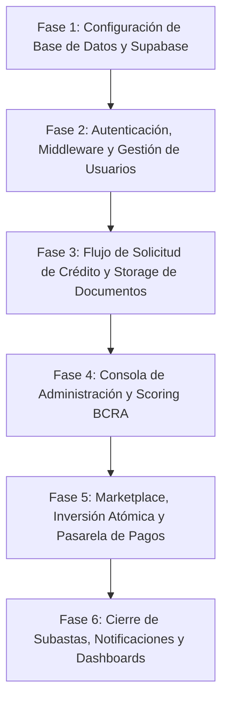

# next_plan.md: Especificación Técnica y Plan de Implementación Integral para Lencord

## 1. Resumen Ejecutivo y Diagnóstico del Estado Actual

Lencord es una plataforma de financiamiento colectivo peer-to-peer (P2P) orientada a conectar pequeñas y medianas empresas (PyMEs) argentinas que requieren crédito productivo con inversores individuales e institucionales que buscan rentabilidad en pesos.

### Diagnóstico Técnico Inicial
Actualmente la plataforma cuenta con una interfaz web desarrollada en Next.js (App Router) y React, pero funciona bajo un entorno simulado en memoria (*in-memory mocks*):
1. **Pérdida de solicitudes entre pantallas:** Al no estar conectada la base de datos real, las solicitudes enviadas en `/solicitar` se guardan en la memoria RAM del navegador a través de `MockStateStore`. Al navegar a `/admin` o recargar la página, Next.js reinicia el estado y la solicitud desaparece.
2. **Botones de autenticación inoperativos:** En el componente `Header`, los botones de "Iniciar sesión" y "Registrarse" no cuentan con rutas ni formularios asociados, disparando eventos vacíos sin conexión a un proveedor de identidad.
3. **Custodia y regulación financiera:** Por normativa argentina (Ley 21.526 de Entidades Financieras y regulaciones del BCRA/CNV), Lencord no realiza intermediación financiera ni custodia dinero de terceros. La gestión de fondos debe recaer en un procesador de pagos regulado (PSP / BaaS).

### Objetivo de este Plan
Detallar las especificaciones técnicas, funcionales, de seguridad y de arquitectura para transformar el prototipo en una plataforma web plenamente operativa conectada a Supabase, con autenticación segura, almacenamiento privado de documentación contable, evaluación crediticia con el BCRA, procesamiento de pagos desacoplado y notificaciones omnicanal.

---

## 2. Decisiones Estratégicas y de Arquitectura Acordadas

1. **Motor de Base de Datos y Persistencia:**  
   Migración definitiva a **Supabase (PostgreSQL)** en la nube. Se aprovecharán las migraciones SQL existentes en el repositorio, la seguridad a nivel de fila (**Row Level Security - RLS**) y la ejecución de procedimientos almacenados atómicos en base de datos.
2. **Autenticación y Registro:**  
   Páginas dedicadas e independientes para `/login` y `/registro` gestionadas mediante `@supabase/ssr` con cookies seguras `HttpOnly`. Selección obligatoria de rol al registrarse: **PyME (Prestataria)** o **Inversor**.
3. **Flujo de Solicitud de Crédito:**  
   Registro previo obligatorio. La empresa debe haber iniciado sesión para ingresar a `/solicitar`. Sus datos de identificación (CUIT, razón social, email) se precargan automáticamente, impidiendo spam o subida anónima de archivos.
4. **Seguridad y Acceso Administrativo:**  
   El acceso a `/admin` se restringe estrictamente por verificación del rol en la base de datos (`profiles.role = 'admin'`). Se provee un script seguro para la creación del primer administrador del sistema (`npm run seed:admin`).
5. **Almacenamiento de Documentos Sensibles:**  
   Bucket privado en Supabase Storage (`loan-documents`). Solo permite subidas en formato PDF (máx. 10 MB). Acceso protegido por RLS: únicamente la PyME propietaria y los usuarios administradores pueden descargar o visualizar los balances y formularios F.931.
6. **Pasarela de Pagos (BaaS) y Cumplimiento Normativo:**  
   Lencord solo custodia los ingresos generados por sus propios spreads y comisiones. El dinero de los préstamos e inversiones permanece bajo la custodia de un Proveedor de Servicios de Pago (PSP / BaaS regulado).  
   * Arquitectura: Implementación modular en sandbox con firmas criptográficas HMAC, estados de retención (`holdFunds`), desembolso (`disburseLoan`) y liberación (`releaseFunds`), con recepción de eventos en `/api/webhooks/payments`.
   * Saldo espejo: El dashboard del inversor muestra un saldo en cuenta ilustrativo sincronizado vía API con la pasarela externa, con leyenda de cumplimiento regulatorio.
7. **Regla de Cierre de Subasta:**  
   Mecanismo de "Todo o Nada" por defecto (requiere el 100% del monto para activarse). Si al cumplirse la fecha límite la subasta alcanza o supera un **umbral mínimo configurable (75%)**, el sistema le ofrece a la PyME una ventana de 48 horas para aceptar el monto recaudado o cancelar la operación liberando las retenciones sin penalidad.
8. **Notificaciones Omnicanal:**  
   Alertas en tiempo real dentro de la plataforma (campana de notificaciones y badges de estado en el dashboard) combinadas con el envío de correos electrónicos transaccionales automáticos ante cada hito crítico.

---

## 3. Arquitectura del Sistema y Modelo de Datos

### 3.1 Esquema Relacional en PostgreSQL (Supabase)

El esquema implementado en `supabase/migrations/` cuenta con las siguientes entidades centrales:

* **`profiles`:**  
  Identificador vinculado directamente con `auth.users(id)`. Almacena `role` (`'investor'`, `'borrower'`, `'admin'`), `email`, `first_name`, `last_name`, `phone`, `tax_id` (CUIT/DNI), `cbu_cvu`, `is_verified` y fecha de creación.
* **`sme_credit_profiles`:**  
  Datos comerciales de la empresa: `legal_name`, `tax_id`, `company_type` (SAS, SA, SRL, Monotributo), `business_sector`, `bcra_situation` (1 a 5), `risk_tier` (`'Tier A'`, `'Tier B'`, `'Tier C'`) y scoring crediticio calculado.
* **`loans`:**  
  Solicitudes de crédito. Campos: `borrower_id`, `amount_requested`, `amount_funded`, `term_months`, `rate_type` (`'TNA_FIXED'`, `'CER_VARIABLE'`), `investor_rate`, `platform_spread`, `category`, `status` (`'draft'`, `'in_review'`, `'funding'`, `'funded'`, `'active'`, `'repaid'`, `'rejected'`, `'expired'`), `funding_deadline`, `balance_sheet_url`, `f931_url`.
* **`investments`:**  
  Tickets de participación en subastas. Campos: `loan_id`, `investor_id`, `amount`, `status` (`'pending'`, `'committed'`, `'refunded'`, `'transferred'`), `gateway_hold_id`.
* **`installments`:**  
  Cronograma de cuotas mensuales de amortización e interés generadas al activarse el préstamo. Campos: `loan_id`, `installment_number`, `due_date`, `principal_amount`, `interest_amount`, `total_amount`, `status` (`'pending'`, `'paid'`, `'late'`).
* **`legal_contracts`:**  
  Pagaré electrónico y contrato de mutuo emitidos tras el fondeo completo. Incluye hash criptográfico del documento, estado de firma (`is_signed`) y código de verificación OTP.
* **`notifications`:**  
  Tabla de eventos y alertas para usuarios. Campos: `user_id`, `title`, `message`, `type` (`'info'`, `'success'`, `'warning'`), `read` (boolean), `action_url`.

### 3.2 Políticas de Seguridad a Nivel de Fila (RLS)

* **Perfiles (`profiles`):**  
  * Los usuarios pueden leer y editar únicamente su propio perfil (`auth.uid() = id`).
  * Los administradores (`profiles.role = 'admin'`) tienen lectura global para auditoría y gestión de créditos.
* **Préstamos (`loans`):**  
  * Las PyMEs solo pueden crear y modificar préstamos en estado borrador o enviarlos a revisión vinculados a su `borrower_id`.
  * Los préstamos en estado `'funding'` (subasta activa) son legibles por cualquier usuario registrado (públicos en el Marketplace).
  * Los préstamos en `'in_review'` solo son visibles por su creador y por usuarios con rol `'admin'`.
  * La actualización de tasas, spreads y cambios de estado a `'funding'` o `'rejected'` está restringida exclusivamente a administradores.
* **Inversiones (`investments`):**  
  * Solo pueden insertarse a través de la función almacenada atómica `commit_investment_atomic`, garantizando que la subasta no supere el 100% bajo condiciones de concurrencia (`FOR UPDATE`).
  * Los inversores solo pueden consultar sus propias inversiones.

---

## 4. Especificación Detallada de Interfaces y Flujos de Usuario

### 4.1 Módulo de Autenticación y Cuentas
* **Ruta `/login`:**  
  * Formulario con email y contraseña.
  * Botón para restablecimiento de contraseña.
  * Redirección inteligente: si el usuario intentó acceder a una ruta protegida (ej: `/solicitar`), tras autenticarse vuelve a la página de origen.
* **Ruta `/registro`:**  
  * Selector inicial de perfil con dos pestañas o tarjetas visuales:
    1. **Soy Empresa (PyME):** Solicita Razón Social, CUIT (con validación de formato y dígito verificador argentino), nombre del apoderado, email y contraseña.
    2. **Soy Inversor:** Solicita Nombre y Apellido, DNI/CUIT, email y contraseña.
  * Creación atómica de la cuenta en `auth.users` y del registro correspondiente en la tabla `profiles`.
* **Actualización del Header de Navegación:**  
  * Estado no autenticado: Muestra los botones "Iniciar sesión" (redirige a `/login`) y "Registrarse" (redirige a `/registro`).
  * Estado autenticado: Reemplaza los botones de acceso por el nombre de la empresa/usuario, badge de rol, saldo en custodia (para inversores), botón hacia su panel (`/dashboard/pyme` o `/dashboard/inversor`) y botón para cerrar sesión.

### 4.2 Flujo de Solicitud de Financiamiento (`/solicitar`)
1. **Control de Acceso:** Requiere sesión activa con rol `'borrower'`. Si accede un inversor, se le notifica que debe contar con cuenta empresa; si no hay sesión, se redirige a `/login?redirect=/solicitar`.
2. **Paso 1 (Identificación):** Se precargan CUIT, Razón Social y email desde el perfil del usuario autenticado. Se completa el tipo societario y datos complementarios de contacto.
3. **Paso 2 (Condiciones):** Monto solicitado, plazo (30 a 360 días), destino de los fondos y esquema de tasa de preferencia.
4. **Paso 3 (Documentación Segura):**
   * Carga de Balance Contable Auditado (opcional según antigüedad o tipo tributario) y Formulario F.931 AFIP/ARCA.
   * Validación del lado del cliente y servidor: tipo MIME `application/pdf`, peso máximo de 10 MB.
   * Subida directa al bucket privado `loan-documents/${borrowerId}/${fileId}.pdf`.
5. **Paso 4 (Declaración y Envío):** CBU/CVU de la PyME para el posterior desembolso, declaración jurada de origen lícito de fondos y envío final.
6. **Post-Envío:** La solicitud pasa a estado `'in_review'`. La PyME es redirigida a `/solicitar/confirmacion` y se emite un correo transaccional de recepción.

### 4.3 Consola de Administración y Mesa de Crédito (`/admin`)
1. **Bandeja de Entrada en Tiempo Real:**  
   Listado de solicitudes con estado `'in_review'`, obtenidas directamente desde Supabase.
2. **Ficha de Evaluación Integral:**  
   * **Datos de la PyME:** CUIT, razón social, fecha de inicio y contacto.
   * **Visor / Descarga de Documentos:** Enlaces autenticados y temporales (Signed URLs con expiración de 15 minutos) para que el analista examine el balance y el F.931.
   * **Módulo BCRA Central de Deudores:** Consulta automática al servicio del BCRA para mostrar el historial de deudas del sistema financiero, bancos informantes y situación crediticia (1 a 5).
3. **Mesa de Aprobación y Configuración de Subasta:**  
   * Asignación del nivel de riesgo: Tier A, Tier B o Tier C.
   * Configuración de la Tasa Nominal Anual para el inversor (`investor_rate`).
   * Asignación del spread de Lencord (`platform_spread`, ej. 2.5%).
   * Fijación de la fecha y hora límite de fondeo (`funding_deadline`).
   * Acciones: Botón **"Aprobar y Publicar en Subasta"** (pasa el estado a `'funding'`) y botón **"Rechazar Solicitud"** (con motivo de rechazo enviado por correo a la PyME).

### 4.4 Marketplace y Proceso de Inversión (`/marketplace`)
1. **Catálogo Público de Oportunidades:**  
   Visualización de todas las solicitudes con estado `'funding'`. Indicadores visuales de porcentaje reunido, días restantes, tasa ofrecida y nivel de riesgo.
2. **Ticket de Inversión (`/marketplace/[id]`):**  
   * Formulario para ingresar el monto a invertir.
   * Validación contra el remanente disponible de la subasta.
   * Ejecución atómica de la inversión contra `SupabaseInvestmentService`:
     1. Instrucción a la pasarela BaaS para retener los fondos en custodia del inversor (`holdFunds`).
     2. Ejecución del procedimiento `commit_investment_atomic` en PostgreSQL con bloqueo pesimista.
     3. Si la subasta alcanza el 100%, transición automática a estado `'funded'` y bloqueo de nuevos ingresos.
     4. Emisión de comprobante de inversión por correo electrónico.

### 4.5 Pagaré Digital y Activación del Crédito
1. Una vez fondeada la subasta al 100%, la PyME accede a su panel para revisar el contrato de mutuo y el pagaré digital generado automáticamente con el cronograma final de cuotas.
2. La PyME ratifica las condiciones mediante firma electrónica / código OTP enviado a su correo o teléfono.
3. Tras la firma, el sistema instruye a la pasarela de pagos el desembolso (`disburseLoan`) al CBU/CVU de la PyME, retiene la comisión de Lencord y activa el préstamo (`status = 'active'`).
4. Se generan las cuotas en la tabla `installments` para su seguimiento y cobro mensual.

---

## 5. Integraciones Externas y Servicios de Servidor

### 5.1 Conector BCRA Central de Deudores
* **Servicio:** `BcraCreditScoringService` (`services/bcra/`).
* **Endpoint oficial:** `https://api.bcra.gob.ar/centraldedeudores/v1.0/Deudas/{cuit}`.
* **Comportamiento:**  
  * Normaliza y valida el CUIT.
  * Realiza la llamada HTTP con control de tiempo de espera (*timeout* de 5 segundos) y encabezados de usuario.
  * En caso de código 404 (sin registros), clasifica a la PyME como "Sin deuda bancaria registrada / Situación 1".
  * Parsea entidades bancarias acreedoras, montos y clasificación histórica (1: Normal, 2: Seguimiento especial, 3: Con problemas, 4: Alto riesgo de insolvencia, 5: Irrecuperable).

### 5.2 Pasarela de Pagos (BaaS) en Custodia
* **Servicio:** `BaaSPaymentGateway` (`services/payments/`).
* **Manejo de Seguridad:** Firmas HMAC-SHA256 con marca de tiempo (*timestamp*) en cada solicitud para impedir ataques de reproducción (*replay attacks*).
* **Ruta de Webhooks (`/api/webhooks/payments`):**  
  Recibe notificaciones asíncronas de la pasarela ante cambios en transferencias, acreditaciones y retenciones. Valida la firma del encabezado `X-Signature` antes de procesar cualquier evento en la base de datos.

### 5.3 Rutas Programadas y Cierre de Subastas (`/api/cron/check-deadlines`)
* **Propósito:** Endpoint seguro invocado de manera periódica (o mediante cron jobs de Vercel/Supabase).
* **Protección:** Requiere el encabezado `Authorization: Bearer CRON_SECRET_KEY`.
* **Lógica de Ejecución:**  
  1. Busca préstamos en estado `'funding'` cuya fecha límite haya expirado (`funding_deadline < NOW()`).
  2. Si el préstamo alcanzó el umbral mínimo (75% o más), envía alerta de aceptación a la PyME por 48 horas.
  3. Si no alcanzó el umbral o fue rechazado, cancela el préstamo (`status = 'expired'`), llama a `releaseFunds` en la pasarela para liberar el dinero retenido a todos los inversores participantes y les envía notificación por email.

### 5.4 Servicio de Notificaciones y Mailing Transaccional
* **Proveedor recomendado:** Resend o proveedor SMTP directo de Supabase Auth.
* **Eventos cubiertos:**
  * Bienvenida y confirmación de cuenta.
  * Notificación a la PyME de solicitud recibida y en análisis.
  * Notificación a la PyME de crédito aprobado y publicado en el Marketplace.
  * Notificación al inversor de inversión retenida con éxito en la subasta.
  * Aviso de subasta completada al 100% y convocatoria a firma de pagaré digital.
  * Notificación de acreditación de cuota mensual a inversores.

---

## 6. Hoja de Ruta de Implementación (Fases de Trabajo)

### Fase 1: Configuración de Base de Datos y Supabase
* Crear/vincular el proyecto de Supabase y definir las variables en `.env.local` (`NEXT_PUBLIC_SUPABASE_URL`, `NEXT_PUBLIC_SUPABASE_ANON_KEY`, `SUPABASE_SERVICE_ROLE_KEY`).
* Ejecutar las migraciones SQL acumuladas en `supabase/migrations/` en la base de datos de Supabase.
* Crear el bucket privado `loan-documents` en Supabase Storage y aplicar las directivas de seguridad RLS.
* Activar los servicios reales en `services/factory.ts` reemplazando los errores de fallback.

### Fase 2: Autenticación, Middleware y Gestión de Usuarios
* Desarrollar las páginas `/login` y `/registro` con diseño responsive acorde a la paleta institucional (Plus Jakarta Sans, azul cobalto, estados de carga y validaciones).
* Conectar el registro de usuarios con roles diferenciados (`'borrower'` e `'investor'`) y persistencia en la tabla `profiles`.
* Implementar `middleware.ts` en la raíz de Next.js para proteger rutas privadas (`/solicitar`, `/dashboard/*`, `/admin`).
* Desarrollar el script de aprovisionamiento del administrador seguro (`npm run seed:admin`).
* Actualizar el componente `Header` para reflejar el estado de autenticación, visualización del rol y acción de desconexión (*sign out*).

### Fase 3: Conexión de `/solicitar` y Almacenamiento Privado
* Envolver la aplicación en `RootLayout` con el contexto de servicios real.
* Modificar `LoanWizard.tsx` para obtener el `borrowerId` del usuario autenticado en lugar de valores fijos.
* Conectar el paso 3 de documentación al cliente de Supabase Storage para subir los archivos PDF reales y guardar las referencias seguras en la tabla `loans`.
* Guardar la solicitud en estado `'in_review'` en la base de datos y verificar que persista ante recargas de página.

### Fase 4: Consola de Administración y Mesa de Crédito
* Conectar `AdminConsole.tsx` a `SupabaseLoanService` para listar las solicitudes en revisión en tiempo real.
* Implementar generación de URLs firmadas temporales para visualización y descarga de balances y comprobantes fiscales por parte del administrador.
* Conectar la consulta en vivo de antecedentes en la Central de Deudores del BCRA mediante el CUIT de la solicitud.
* Conectar las acciones de aprobación con asignación de tasas, spreads y fecha límite, cambiando el estado a `'funding'`.

### Fase 5: Marketplace, Inversión Atómica y Pasarela de Pagos
* Conectar la grilla de `/marketplace` para recuperar únicamente las subastas activas de Supabase.
* Conectar el modal de inversión a `SupabaseInvestmentService.commitInvestment()` ejecutando el RPC `commit_investment_atomic` y validando capacidad remanente.
* Integrar el adaptador de pagos BaaS en sandbox para registrar retenciones de fondos y simular el saldo espejo en el dashboard del inversor.
* Implementar el endpoint `/api/webhooks/payments` para escuchar confirmaciones de pago.

### Fase 6: Cierre de Subastas, Notificaciones y Dashboards
* Implementar la rutina de verificación de vencimientos y umbral mínimo (75%) en `/api/cron/check-deadlines`.
* Conectar la firma del pagaré digital con validación OTP para préstamos fondeados al 100%.
* Conectar los dashboards `/dashboard/pyme` y `/dashboard/inversor` con métricas financieras y calendario de cuotas.
* Configurar el servicio de envío de correos transaccionales para los eventos clave de la plataforma.

---

## 7. Criterios de Aceptación y Validación de Éxito

La plataforma se considerará completamente funcional cuando se cumplan las siguientes condiciones en el entorno integrado:
1. Un usuario nuevo puede registrarse como PyME desde `/registro`.
2. Al ingresar a `/solicitar`, sus datos básicos están precargados; completa los 4 pasos, adjunta dos archivos PDF reales y envía la solicitud.
3. La solicitud no se pierde al recargar el navegador y aparece de inmediato en `/admin`.
4. El administrador puede autenticarse, ingresar a `/admin`, abrir y leer los PDFs subidos, consultar el reporte crediticio del BCRA, definir la tasa/spread y aprobar la solicitud.
5. El préstamo aprobado aparece publicado automáticamente en el catálogo de `/marketplace`.
6. Un usuario inversor registrado puede ingresar al préstamo, comprometer fondos y observar cómo la barra de fondeo se actualiza en tiempo real hasta alcanzar la meta.
7. Al completarse la subasta, la PyME firma el pagaré digital desde su dashboard y se genera el cronograma mensual de cuotas.
